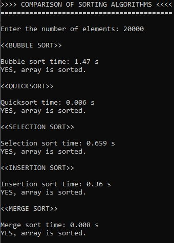

# Sorting algorithms

## Table of contents

- [Overview](#overview)
  - [About](#about)
  - [Screenshot](#screenshot)
- [My process](#my-process)
  - [Built with](#built-with)
  - [Useful resources](#useful-resources)

## Overview

### About

Simple application comparing 5 best-known sorting algorithms in terms of calculation time:

- Bubble sort
- Quicksort
- Selection sort
- Insertion sort
- Merge sort

INPUT: number of unsorted elements

OUTPUT: sorting time depending on sorting algorithm, checking if the array is sorted.

What do you think which one is the fastest?

### Screenshot

## My process

### Built with

- Structured programming
- Sorting algorithms
- Arrays
- Dynamic memory allocation
- time.h library

### Useful resources

- https://www.geeksforgeeks.org/sorting-algorithms/
- https://www.programiz.com/dsa/sorting-algorithm
- https://www.algorytm.edu.pl/algorytmy-maturalne.html
